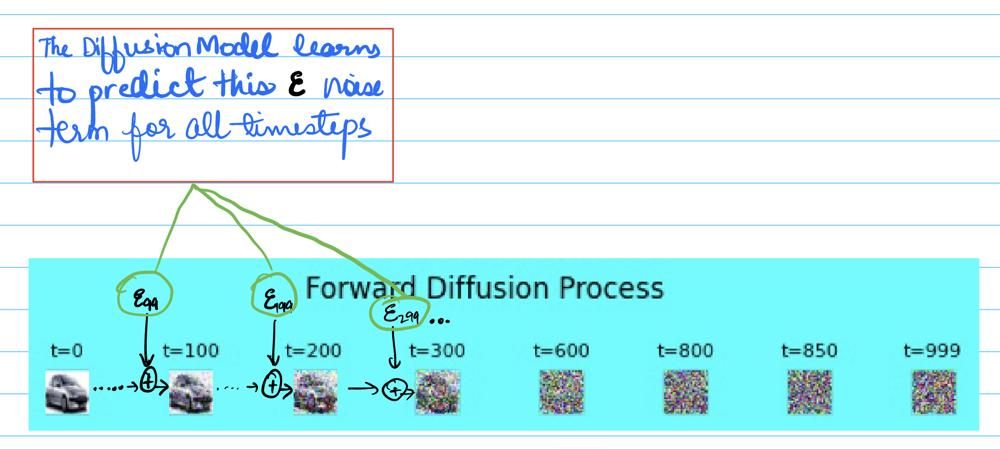

+++
title = "DDPM--Key Implementation Details & Takeaways"
date = 2026-02-15T12:00:00-05:00
author = "Akshit Mishra"
math = false
tocOpen = true
+++

# DDPM--Key Implementation Details & Takeaways


- Medium Link: https://medium.com/@akshitmishra1995/what-to-expect-55891597736f

- Code: https://github.com/mishra39/diffusion_models/tree/main/DDPM


## What to Expect?
**What does this post cover**:
- Intuition, implementation details, and takeaways I observed while implementing Denoising Diffusion Probabilistic Model (DDPM) from scratch. 
- Forward and reverse diffusion process
- High-level UNet model architecture
- ResNet and attention layers setup
- Full implementation code can be found at: https://github.com/mishra39/diffusion_models/tree/main/DDPM


**What does this post not cover:**
- The post does not go over the complete DDPM problem setup or the underlying math. For that I encourage you to read https://lilianweng.github.io/posts/2021-07-11-diffusion-models/ and https://learnopencv.com/denoising-diffusion-probabilistic-models/#Writing-DDPMs-From-Scratch-In-PyTorchf 
- In particular, I encourage you to read the section in [2] that breaks down why estimating the noise in DDPM is sufficient. 
With that out of the way, let's get into it.

## Diffusion
Generative models are becoming increasingly popular over the past few years. They have already proven their might in audio and video generation, and are increasingly gaining more applications in the robotics domain as well. A lot of recent self-driving architectures leverage generative models to create end-to-end pixels to action models. 

- Diffusion models are a class of generative models that use a Markov chain to model the image noising and de-noising process. 
- The noising process is also called the forward diffusion process, and the denoising process is termed as reverse diffusion process. 
- In simple terms, we first add random noise to a clean and meaningful image to turn it into a collection of random pixels with random values. Then we train a deep neural network to estimate the random noise. 

Note that this random noise is added iteratively, and the network learns to estimate the noise at each timestep. 


Figure 1: Forward (x₀ → x_T) and reverse (x_T → x₀) diffusion process. Source: Ho et al., 2020
## Intuition
**💡 Key Idea**
```
We can gradually convert one distribution into another using a Markov chain.
```

Let's assume our diffusion model is trained on input images of size (C, H, W) = (3, 256, 256), where C is the number of channels (3 for RGB) and 256 is the height and width of the image.
We can put any random number in these 196,608 (3x256x256) locations but only a small subset of those would result in meaningful images.
For training diffusion models, we pick a collection of images from this small subset of clean images, and then add random noise to teach the model how to go from a random position in the 3x256x256 space to a point in our the meaningful image subset.  


Figure 2: Diffusion process visualization. Source: LearnOpenCV

The forward diffusion process takes a meaningful image to random noise and the reverse diffusion process learns the reverse process.


## Why do we care?

Diffusion models are not the only deep generative method that can help reconstruct meaningful information. There are other known methods such as Generative Adverserial Networks (GANs), Variational AutoEncoders (VAE), and flow-based methods as well. So what's the appeal of using diffusion models? 
- **Higher Fidelity**: Produce **higher quality outputs** (lower FID scores) than GANs. 
- **Mode Coverage**: Capture the full diversity of the target data distribution
- **Mode Collapse**: Model collapse here refers to when a model  produces repetitive and low-diversity outputs, focusing only on a few modes of training.  Diffusion models are known to have better stability than GANs when it comes to mode collapse.


# Key Implementation Details
One important part of the mathematical derivation in DDPM is that the diffusion model (UNet in this case), does not directly learn to generate images; instead it learns to predict the noise added at each timestep in the forward diffusion state.

Figure 3: Forward (x₀ → x_T) process

## Model Architecture

Figure 4: U-Net architecture used in DDPM (generated using Nano Banana)
## Time Embeddings: Teaching the Network About Noise Levels
It is important for the network to know which timestep it needs to predict the noise for. However, we cannot directly pass a timestep number 512 to the network as it doesn't capture the relationship between timesteps. The network can't easily learn that steps 499, 500, and 501 are related, or that early and late diffusion require fundamentally different strategies.
Instead we use sine and cosine functions to represent the numbers in the following manner:
- Convert timestep (t=500) to an embedding vector with specified dimension (d=128)
	- Half of the embedding vector (even positions) represents sine waves and the other half (odd indices) represent cosine waves with different frequencies
	- Both sine and cosine functions are used to capture the full picture and reduce ambiguity sin(30) = sin(150)
	- The motivation behind creating a 128 element vector is so we can capture both high-frequency components (fine-grained difference between close timesteps) and low-frequency slow oscillations between far timesteps for coarse vs. fine-grained denoising
- For task-specific understanding we pass the time embedding through a small MLP:
	 ```
	 nn.Linear(128 → 512) → SiLU() → nn.Linear(512 → 512)
	 ```
	 where 512 represents the expanded time-dimension so we can concatenate the time-embedding output with other layers of the network at each step.
- Each layer projects the time-embedding vector from 512 to match its channel output size (128, 256, 512, ...) allowing each layer to interpret time differently--early layers might use it to control edge sharpening, while deep layers use it for semantic coherence

### Encoder vs. Decoder ResNet blocks
As shown in the image above, the backbone UNet is made up of several layers of ResNet blocks.
- Each layer in the encoder has 2 ResNet Blocks and one Downsample layer. 
- ResNet blocks process features from the input image with time embeddings 
- Downsample layer reduces the spatial resolution for all except the deepest level

- 👉 The decoder has a similar setup except each layer has 3 ResNet blocks instead of two
- Two blocks correspond to the encoder's two ResNet blocks at that level
- One extra block corresponds to the downsample operation from the previous encoder level


Figure 5: ResNet block diagram  (generated using Nano Banana)

- 👉 The residual connection (adding the input back) is critical—it means the network only needs to learn the **changes** to make, not reconstruct everything from scratch. This makes training much more stable, especially in very deep networks.

**Concatenation vs. Addition**:

```
# Decoder
encoder_features = outs.pop()  # Get saved encoder features
h = torch.cat([h, encoder_features], dim=1)  # Concatenate
h = ResNetBlock(h)  # Process the combined features
```
The decoder code uses concatenation and not addition because:
- ResNet learns how to fuse the encoder features with the decoder features
- Addition: Forces a specific combination that might not be optimal
### Skip Connections
Each skip connection brings back information such as fine-grained features, color information, etc. that was lost during downsampling
- 👉In the decoder, each ResNet block receives skip connections with different channel counts
	- First decoder block: `[1024 decoder + 512 encoder]` → 1536 total input channels
	- Second decoder block: `[512 decoder + 512 encoder]` → 1024 total input channels
	- Third decoder block: `[512 decoder + 256 encoder]` → 768 total input channels

## Optional Attention for Global Context
The attention mechanism is great for capturing long-range dependencies whereas convolutions are inherently local. Since global context is important for denoising--when denoising a cat's tail, it's important to know where its head is--some of the ResNet blocks use attention to capture this relevant context. 
**So why do we not use attention in all the ResNet blocks?**
	- 👉 Attention has O(N^2) complexity, so for a 64x64 resolution input, that's 4,096² = 16,777,216 operations. That's way too expensive!
	- Instead we use attention at 16x16 (256² = 65,536 operations)  or 8x8 (64²=4,096 operations)
	- DDPM uses **Multi-head Attention (MHA)** where each heads learns something unqiue
	- The input [Batch, Channels, Height, Width] = [4, 512, 16, 16] is reshaped into a sequence of tokens, resulting in a tensor of shape `[Batch, Sequence_Length, Embedding_Dimension]`, which in your example is `[4, 256, 512]`
		- This allows the MHA block to view each input as a feature vector of size 512
		- The Embedding dimension is split equally between the heads
			- For 4 heads in MHA, each head gets `512/4 = 128` 
	

Figure 6: Attention block applied at low-resolution feature maps (generated using Google Nano Banana)

## Training Process

Figure 7: DDPM training algorithm. Source: Ho et al., 2020

The training algorithm can be broken down in the following steps:
- Sample a batch of images from input dataset
- Generate random timesteps
- Run forward process (add noise) on the training images
- Predict the noise added to these images using the diffusion model
- Compute the loss and run gradient descent based on the ground truth noise (sampled in line 4 of algo 1) and the predicted noise from the model

## Inference/Sampling

Figure 8: DDPM sampling algorithm. Source: Ho et al., 2020

- 👉 Stochastic nature of reverse process;
	- We actually **add noise back** at each step—except the very last one
	```
	p(x_{t-1} | x_t) = N(x_{t-1}; μ(x_t, t), σ²_t I) -> equation for reverse process
	```

**Key Idea**	
```
Given the current noisy image at time t, the previous (less noisy) image follows a Gaussian distribution with mean μ and variance σ²." To properly sample from this distribution, we need to add Gaussian noise scaled by σ_t 
```

Without this inherent stochasticity the sampling process becomes deterministic, which leads to **mode collapse** and the model has low diversity in the generated samples.
This added noise adds an **exploration** dimension to the denoising process.

- 👉 No noise added in line 3 for t = 0 as we want the final image to be clean (no noise)
- Image is denoised iteratively using the noise predictions from the model


# Takeaways
- Provide positional context everywhere: Time embeddings are fed to all the ResNet blocks and all the layers in them. This is key for the network to learn the right amount of denoising
- Judicious use of Attention: As we saw attention is an expensive operation, so we need to use it wisely to avoid performance bottlenecks
- Resnet Layers asymmetry: The decoder has 3 layers of ResNet blocks vs. 2 in the encoder for proper skip connection fusion
- Stochastic nature of reverse diffusion is important for the model to have diversity at inference


# References

1. Ho, J., Jain, A., & Abbeel, P. (2020). _Denoising Diffusion Probabilistic Models._ [https://arxiv.org/abs/2006.11239](https://arxiv.org/abs/2006.11239)
    
2. Weng, L. (2021). _What are Diffusion Models?_ [https://lilianweng.github.io/posts/2021-07-11-diffusion-models/](https://lilianweng.github.io/posts/2021-07-11-diffusion-models/)
    
3. LearnOpenCV. _Denoising Diffusion Probabilistic Models – Writing DDPMs From Scratch In PyTorch._ [https://learnopencv.com/denoising-diffusion-probabilistic-models/]
