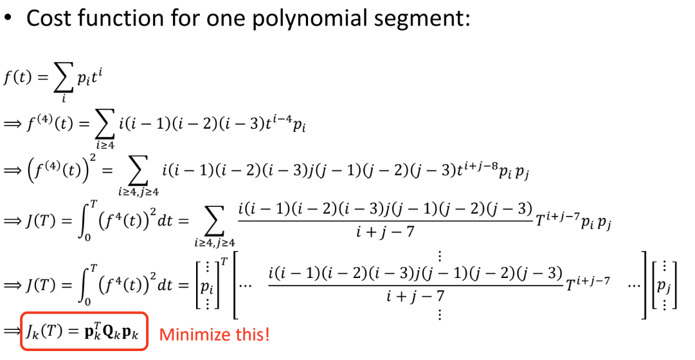
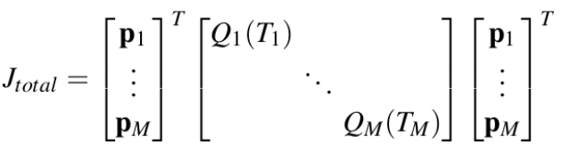
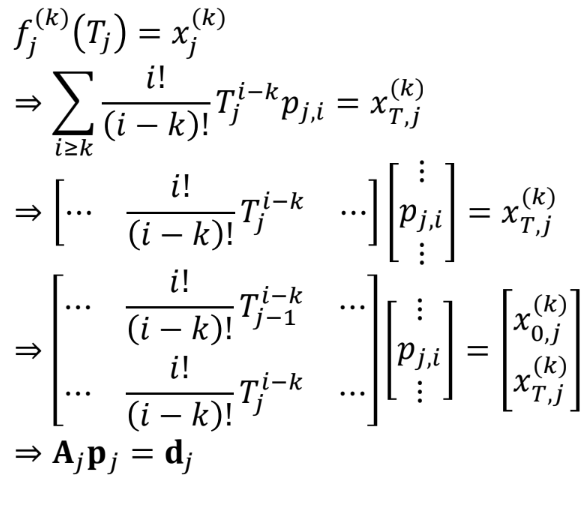
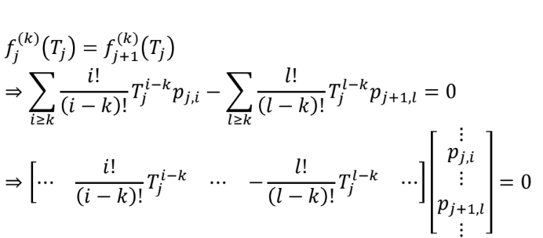
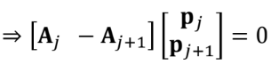
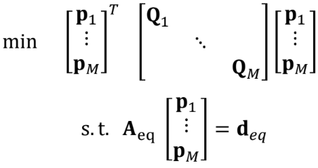

+++
title = 'Minimum Snap Trajectory Generation-Part 1'
date = 2024-07-19T07:28:02-04:00
draft = false
math = true
tocOpen = true
+++
# Minimum Snap Trajectory Generation-Part 1

## 👋Introduction
In robotics, motion planning addresses the challenge of moving a robot from a starting point (point A) to a desired goal point (point B). The specific approach to motion planning depends heavily on the type of robot and its environment. For instance, the solution for an industrial robot arm's end effector to reach a specific point will be vastly different from that needed for a quadcopter to navigate a complex environment.

_Grasp Planning for a robot arm. 
Source: https://moveit.picknik.ai_

_Motion Planning for a quadcopter. 
Source: https://github.com/HKUST-Aerial-Robotics/Fast-Planner_

Consequently, a motion planning strategy ideal for a robotic arm performing a pick-and-place operation wouldn't translate well to a quadrotor navigating a forest. This highlights the importance of considering factors like the robot's dynamics and environmental constraints when choosing the most effective motion planning approach.

In this blog, we'll delve into generating efficient and dynamically feasible trajectories specifically for quadrotors using **Minimum Snap**.

## 🕵️Overview

First we are going to look at approach [Mellinger et al., 2011] that generates minimum snap trajectory using a constrained Quadratic Programming (QP) formulation by leveraging the differential flatness property of quadrotors. After that we are going to look at the limitations of this approach and see how [Richter et al., 2016] builds on this idea and alleviates some of the issues by using an Unconstrained QP approach.
But first let’s understand Snap.

## ⚡Snap? What’s that?

In Motion planning, Snap refers to the fourth derivative of position, the second derivative of acceleration, or the third derivative of velocity.
So, why not just focus on minimizing acceleration? Minimizing acceleration is definitely important, but it's not the whole story. Let's delve deeper and discover why snap plays a crucial role in generating smooth and efficient trajectories for robots!

 **😭Velocity**: Minimizing velocity can lead to huge jumps in acceleration, which could result in sudden start and stops.

_Minimizing only velocity can lead to sudden and unsafe braking_

😓 **Acceleration**: Minimizing acceleration can lead to discontinuous jumps in jerk, which would result in jerk motion. This is not suitable for applications where tracking is important.

_Focusing only on acceleration can sometimes lead to jumps in jerk causing damange to vehicle componenets_

🙂 **Jerk**: There are some approaches that minimize jerk. Specifically, in applications for tracking, minimizing jerk might be enough and is less computationally intensive than minimizing snap. However, minimizing snap takes it a step further and generates even smoother flight profiles. This is important when flying with delicate cargo or trying to generate efficient motion profiles.

_Minimizing jerk is a good approach for tracking targets_

😃 **Snap**
There are a lot of inherent advantages of minimizing snap over minimizing velocity and acceleration so let’s look and understand some of the most significant ones.

Continuity in control inputs
Snap-minimized trajectories ensure continuity up to the third derivative of position (jerk), which means the control inputs required to follow the trajectory will be continuous.
Compatibility with differential flatness:
Quadrotor dynamics are differentially flat with respect to the position and yaw angle. Minimizing snap aligns well with this property, making it easier to generate dynamically feasible trajectories.
Continuity in control inputs:
Snap-minimized trajectories ensure continuity up to the third derivative of position (jerk), which means the control inputs required to follow the trajectory will be continuous.
This is particularly important for aggressive maneuvers where discontinuities in lower-order derivatives could lead to instability.

These properties help generate smooth and elegant trajectories for quadcopters when minimizing snap. Furthermore, minimizing snap also helps reduce the stress on actuators by preventing sudden changes in thrust.

_Minimizing Snap creates elegant motion profiles_

## 🥫Differential Flatness: The secret sauce!
Differential flatness is a potent concept in control theory that can be applied to the trajectory optimization problem for quadrotors to generate dynamically feasible trajectories. 

A set of variables in a system is considered differentially flat if we can reconstruct all the system's states and control inputs using just a chosen few of these variables and their derivatives. It might sound like a magic trick, but there's a clear logic behind it! Let's unravel this concept with the help of a quadrotor model example.

For a quadrotor, if we pick the 3D position (x, y, z) and yaw angle (ψ) as our flat outputs, then remarkably, we can express all other states (velocity, acceleration, etc.) and the control input (motor thrust) as functions of these chosen flat outputs and their derivatives.

Let’s look at some straightforward equations to drive this point home.

- **Flat outputs**: [x,y,z,ψ]
- **States**
    - Velocity: v = [ẋ, ẏ, ż] is just the first order derivative of flat outputs  x, y, z
    - Acceleration: a = [ẍ, ÿ, z̈] is just the second order derivative of  x, y, z. 

    - Roll: $\varphi = \sin^{-1} \left( \frac{\ddot{x} \sin \psi - \ddot{y} \cos \psi}{g} \right)
$
    - Pitch: $\theta = \sin^{-1} \left( \frac{\ddot{x} \cos \psi + \ddot{y} \sin \psi}{g \cos \varphi} \right)
$

Jerk and Snap can be represented in a similar way. To drive the point home further, we can look at attitude equations above that show  roll and pitch can also be represented just using the derivatives of the differentially flat variables we chose.

### From Theory to Flight: How Flatness Simplifies Trajectory Planning

The gargantuan advantage of the differential flatness property is that we don’t have to optimize over the entire state space. We can just solve for the flat outputs (x,y,z, yaw) and the rest of the states and inputs can be obtained using the equations above.

And it doesn’t stop there! This property also ensures that the generated trajectories are **dynamically feasible**. This is due to the fact that whatever values we obtain for the inputs using the flat output variables are calculated using the dynamics of the system. Let’s look at the example below to fully grasp this concept.

Let’s say we solve for flat outputs X = [x, y, z, ѱ]. Then we can obtain the states (velocity, acceleration, ..etc.) and inputs (Thrust from motors) using these values as shown above.
After computing acceleration, we can use that to calculate Thrust as:

$$
T = m \sqrt{\ddot{x}^2 + \ddot{y}^2 + (\ddot{z} + g)^2}
$$

Since acceleration, Thrust and other states (pitch,roll,etc.) are computed using the equations of motion, the generated trajectories are guaranteed to be dynamically feasible.

## Minimum Snap, Maximum Control

Now, let’s do what we came here for and understand the problem setup for minimum snap trajectory generation.

- **Objective:** Generate a minimum snap trajectory for a quadcopter.
- **Inputs:**
    1. 3D position of waypoints.
    2. Boundary conditions: Desired velocities and acceleration for start and end point
    3. Maximum velocity of the quadcopter.

- **Constraints:**
    1. Fixed start and end states. 
    2. Trajectory passes through the waypoints

- **Notation:**

    
The notation in the rest of this article to show trajectory terms is defined above. For instance, $x^{2}_{0,1}$ represents the 2nd derivative (acceleration) for segment 1 at time 0.

_For our example we have 3 waypoints with 2 segments connecting the waypoints_

## 🧪Formulation
The first step is to represent our desired trajectory using a polynomial equation. In order to minimize snap we need at least a seventh degree polynomial as shown below.

$$
f(t) = p_7 t^7 + p_6 t^6 + p_5 t^5 + p_4 t^4 + p_3 t^3 + p_2 t^2 + p_1 t + p_0
$$

### Why the Magic number 7️⃣?

The reason we need at least a 7th degree polynomial to solve for a minimum snap trajectory is due to the number of unknown boundary conditions (explained in more detail later). 
For minimizing snap over segment, we need to solve for the following variables at the start and end points:

1. Position (0th derivative)
2. Velocity (1st derivative)
3. Acceleration (2nd derivative)

The total unknowns are 6 (3 for each start and end waypoint of each segment). Moreover, we can strategically set certain coefficients to zero based on the chosen boundary conditions (e.g., setting jerk to zero at the beginning). This allows us to use a 7th-degree polynomial to represent a minimum snap trajectory with 7 unknowns.

For our example, let's break down the trajectory into segments. The polynomial for each segment i is represented by a polynomial $f(t)$ as shown below. 

We assume each segment starts at time $T_{i-1}$ and ends at time $T_i$, i.e time interval for segment i, $t_i ∊ [T_{i-1}, T_i]$. For now let’s assume the time interval is fixed for each segment. In the next part of this blog, we will see how we can optimize for this parameter as well. The equation below shows one possible way to compute the time for a segment i using the distance between waypoints and the maximum velocity of the vehicle.

$$T = \frac{||(x_1, y_1) - (x_2, y_2)||}{V_{max}}
$$

## What We Know, What We Don't: The Known and the Unknowns of the problem

It is crucial to understand the known and unknown entities. As shown in the figure below, we know the positions of all the waypoints and we can also set the desired velocities and accelerations for the start and end waypoints.

This brings us to the more interesting part, THE UNKNOWNS! 

Let's zoom out and consider the bigger picture of trajectory generation. We aim to utilize provided waypoints to design a smooth motion path for the quadcopter to follow. This translates to pinpointing the exact velocities, accelerations, and so on, that the drone needs to maintain at each waypoint. While we typically have the desired values for the start and end points, the challenge lies in determining the first-order and higher derivatives (velocity, acceleration, etc.) for the intermediate waypoints. In our simple example above, there's only one such intermediate point: waypoint 2.

## 🪙Cost Function
We need to provide a cost function for every optimization problem. This function guides the optimizer as it tries to minimize the value of this function at all times. As we are trying to minimize snap, our cost function will be the square of the fourth-order derivative (snap) of our polynomial trajectory $f(t)$. The construction of the cost function and matrix Qk is shown below.

The matrix form for the cost function can be represented as shown here.

where,
 
**M:** number of segments

Building on the equations presented earlier, we calculate the fourth-order derivative using the general formula for the $i^{th}$ derivative. To achieve a more robust cost function, we then square the resulting equation. Finally, we integrate this squared term over the entire segment's trajectory.

## 🔒Constraints

### Derivative Constraints
- Waypoint Constraint
     
    This constraint ensures that the trajectory passes through the mission waypoints provided as inputs to the problem. For our example, it looks something like this:
    1. For segment 1, position at time 0 should be at waypoint 1 (P1) and waypoint 2 (P2) at time $T_1$. From the polynomial equation above we get:
    $$f^0_{1,0} = P_1 = p_7*(0) + p_6*(0) + p_5*(0) + p_4*(0) + p_3*(0) + p_2*(0) + p_1*(0) + p_0
$$
$$f^0_{1,0} = P_1 = p_0$$
$$f^0_{1,T_1} = P_2 = p_7*(T_1) + p_6*(T_1) + p_5*(T_1) + p_4*(T_1) + p_3*(T_1) + p_2*(T_1) + p_1*(T_1) + p_0
$$
 
Combining this for all the waypoints in our example we get: 

$ \begin{bmatrix}
 f^0_{1,0}\\
 f^0_{1,T_1}\\
 f^0_{2,0}\\
 f^0_{2,T_2}
\end{bmatrix} = \begin{bmatrix}
P_1 \\
P_2 \\
P_2 \\
P_3
\end{bmatrix}
$

### Start and End States Constraints
Next we want to ensure that the quadcopter has desired states at start and end points of the trajectory. This can be represented as shown below.

$ \begin{bmatrix}
 f^1_{1,0}\\
 f^2_{1,0}\\
\vdots \\
 f^k_{1,0} \\
\\
 f^1_{2,T}\\
 f^2_{2,T}\\
\vdots \\
 f^k_{2,T}
\end{bmatrix} = \begin{bmatrix}
v_0 \\
a_0 \\
\vdots \\
v_2 \\
a_2 \\
\vdots \\
p^k_2
\end{bmatrix}
$
 
where,
$v_i$, $a_i$ are the velocity and acceleration for $i^th$ segment and $p^k_2$ is the kth derivative of the polynomial.

In our example, we want to start and end at zero velocity and acceleration.

Velocity and acceleration  for segment 1 at $T = 0$:

$$f^1_{1,0} = p_1 = 0 $$
$$f^2_{1,0} = 2 * p_2=0$$

Finally, the generalized form of $i^th$ derivative of the polynomial is shown below along with the construction of the constraint matrix A.

where, 
$A_j$: constraint mapping matrix  
$p_j$: matrix of polynomial coefficients 
$d_j$: derivative matrix

### Continuity Constraints
Because we optimize each trajectory segment independently, we must guarantee a smooth transition between segments. This is achieved by enforcing continuity constraints, ensuring that the polynomial and its derivatives match at the connection points between segments. In our example, this constraint applies to waypoint 2, an intermediate waypoint.

The set of equations below capture this constraint by ensuring that the polynomial trajectory and its derivatives have the same value at time Tj (T1 for our example) when we switch from segment 1 to segment 2 polynomial coefficients.

This leads us to our **constrained QP formulation.**

The constrained QP solves for the coefficients of the polynomial trajectory for each segment while minimizing the cost function and satisfying the previously discussed criteria. Note that the criteria are represented as equality constraints.
 
Once we find $p_{i,j}$ for each segment i, we can simply plugin the time values in equation $f^k(t)$ to find the value of the trajectory or its derivative at that instant t.
### Constrained QP Method Demo
<iframe width="560" height="315" src="https://www.youtube.com/embed/MvRTALJp8DM?si=r7heCvWbiloR2J2e" title="YouTube video player" frameborder="0" allow="accelerometer; autoplay; clipboard-write; encrypted-media; gyroscope; picture-in-picture; web-share" referrerpolicy="strict-origin-when-cross-origin" allowfullscreen></iframe>

## Not perfect yet: Issues with Constrained QP
Although this setup of using constrained QP to generate minimum snap trajectories is a great starting point, it certainly has some major flaws. In Part 2 of this article, we’ll see how **_[Richter et al., 2016]_** solves these issues by generating a more robust formulation. Some of the issues with the current constrained QP are discussed below.

- **No closed-form solution:**
This method of constrained QP with equality constraints to generate minimum snap trajectories works well for only single segments and short trajectories. It quickly becomes problematic to use for multiple segments represented with high-order polynomials.

- **Numerical Instability:**
The variables being optimized for are the coefficients of the polynomials. This can lead to numerical stability issues as these coefficients can be quite small in values, which can cause issues when inverting matrices.

- **No time allocation:**
This setup requires us to know  the time allocation (T1, T2) for each trajectory in advance. However, to generate fast and smooth motions we also need to optimize for the time variable T for each segment. 

## Conclusion
In this article, we reviewed **_[Mellinger et al., 2011]_** approach on how to generate minimum snap trajectories using the differential flatness properties of a quadrotor. We also covered how to construct the cost matrix Q and the constraint matrix A based on the problem setup.
In the next article, we will see how **_[Richter et al., 2016]_** builds on this approach to generate even faster and more robust minimum snap trajectories using an unconstrained QP formulation.

<iframe src="https://giphy.com/embed/xUPGcyuPRNjODvvOFO" width="319" height="480" style="" frameBorder="0" class="giphy-embed" allowFullScreen></iframe>
<a href="https://giphy.com/gifs/coffee-skateboarding-rad-xUPGcyuPRNjODvvOFO">via GIPHY</a>

## References
1. Mellinger, Daniel, and Vijay Kumar. "Minimum snap trajectory generation and control for quadrotors." 2011 IEEE international conference on robotics and automation. IEEE, 2011.

2. Richter, Charles, Adam Bry, and Nicholas Roy. "Polynomial trajectory planning for aggressive quadrotor flight in dense indoor environments." Robotics Research: The 16th International Symposium ISRR. Springer International Publishing, 2016.

3. [Introduction to Aerial Robotics](https://gaowenliang.github.io/HKUST-ELEC5660-Introduction-to-Aerial-Robots/project/project.html
)